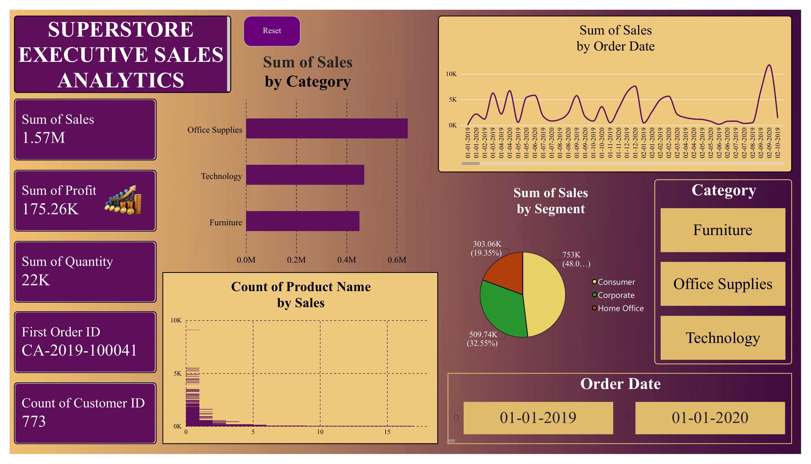

# 📊 Superstore Executive Sales Analytics (Individual Project)

An end-to-end data analytics pipeline that transforms 2 years of raw retail transaction data (2019–2020) into an executive-level Power BI dashboard, covering data extraction, ETL cleaning with Alteryx, and interactive visualization.



## 🎯 Objective

Retail leadership needs a fast, reliable view of sales performance across categories, segments, and time. This project builds a complete pipeline — from raw, messy transaction data to a polished executive dashboard — to answer: *What's driving revenue, which segments matter most, and how is performance trending?*

## 🔑 Key Insights

- **Total Revenue: $1.57M | Total Profit: $175.26K | Total Quantity Sold: 22K units** across ~5,900 transactions (2019–2020)
- **Consumer segment dominates**, contributing **48.09% ($753K)** of total sales — the primary revenue driver, ahead of Corporate (32.55%) and Home Office (19.35%)
- **Office Supplies and Technology** lead total sales volume, while **Furniture** sub-categories show narrower profit margins — a candidate for pricing review
- **Q3 and Q4** show consistent seasonal sales spikes across both 2019 and 2020
- Dashboard supports **Year-level filtering (2019 vs 2020)** for year-over-year comparison

## 🛠️ Tools & Skills Used

| Tool | Purpose |
|---|---|
| **Alteryx Designer** | ETL pipeline — extraction, cleansing, deduplication, and data quality transformation on ~5,900 raw records |
| **Power BI Desktop** | Data modeling, DAX measures, and interactive executive dashboard |
| **Power Query (M)** | Data type correction, header promotion, source management |
| **DAX** | Sum of Sales, Profit, Quantity measures and % share calculations |

## 🔍 Data Engineering & Quality Notes

Raw data was sourced as a public CSV dataset and processed through an Alteryx ETL workflow before loading into Power BI. During QA review of the cleaned dataset, the following issues were identified and corrected:

- **Ship Date truncation bug**: The initial cleaning step stripped the Ship Date field down to just the day-of-month (e.g. `07-01-2019` → `7`), silently losing month/year information. This was traced back to the raw source, cross-validated row-by-row, and restored to full `DD-MM-YYYY` format.
- **Ambiguous Returns flag**: The `Returns` column mixed `1` and `#N/A` values — recoded to a clear `Yes` / `No` boolean for readability.
- **Junk columns removed**: The raw export contained empty placeholder columns (`ind1`, `ind2`) and a corrupted header cell, which were dropped during cleaning.
- **Locale-sensitive date parsing**: Power BI's default locale misread `DD-MM-YYYY` dates as `MM-DD-YYYY`, causing type-conversion errors for any day value above 12. Resolved using explicit locale-aware type conversion in Power Query.

Catching and documenting this kind of issue is a core part of the ETL process — a dashboard is only as trustworthy as the pipeline feeding it.

## 📈 Dashboard Features

- **KPI Scorecards** — Sales, Profit, Quantity, First Order ID, Customer Count at a glance
- **Sales by Category** — Horizontal bar comparing Office Supplies, Technology, and Furniture
- **Sales Trend by Order Date** — Line/area chart tracking daily sales across the 2-year window
- **Sales by Segment** — Donut chart showing Consumer / Corporate / Home Office market share
- **Product Distribution** — Product count analysis by sales bracket
- **Interactive Controls** — Category and Order Date slicers with a Reset button for dynamic cross-filtering

## 📁 Repository Structure

```
superstore-executive-sales-analytics/
├── README.md
├── Superstore_Executive_Sales_Analytics.pbix   # Power BI report file
├── data/
│   ├── SuperStore_Sales_Dataset_RAW.csv        # Original raw dataset
│   └── Cleaned_Sales_Data.csv                  # Alteryx-cleaned + QA-corrected dataset
├── reports/
│   └── Executive_Sales_Analytics_Report.pdf    # 2-page written executive summary
└── assets/
    └── dashboard_screenshot.png
```

## 🚀 How to View

1. Download `Superstore_Executive_Sales_Analytics.pbix`
2. Open with [Power BI Desktop](https://powerbi.microsoft.com/desktop/) (free)
3. Use the Category and Year slicers to explore performance interactively

## 👤 About

Part of my data analytics portfolio, built to demonstrate a complete raw-data-to-dashboard workflow: extraction, ETL with Alteryx, data quality troubleshooting, and executive-level BI reporting in Power BI.
